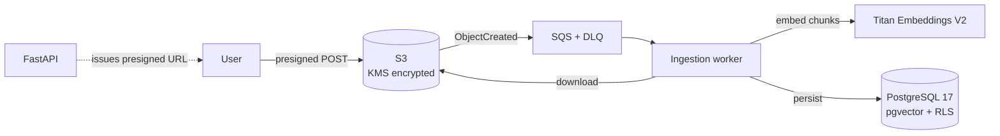
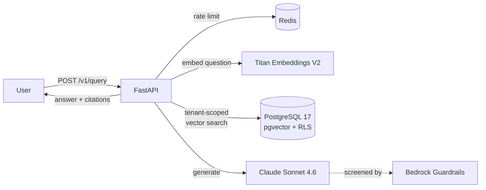

# DocuMind AI

Upload your documents, ask questions in plain language, and get answers grounded in
those documents with citations back to the exact source passages.

DocuMind is a multi-tenant RAG (retrieval-augmented generation) platform built on AWS
with infrastructure as code. Tenant isolation is enforced by PostgreSQL row-level
security rather than application filtering, and every significant architectural
choice is recorded in [`docs/decisions-log.md`](docs/decisions-log.md) alongside the
alternatives that were rejected.

**Status:** In active development — Sprint 9 of 24 complete (`v0.9.0`).

Working today: text document upload, asynchronous ingestion with real embeddings,
tenant-scoped semantic search, and grounded answers with citations — all through an
authenticated API.

Not yet built: web frontend, image and voice ingestion, and measured retrieval
quality (the benchmark harness is Sprint 10). Known gaps are recorded in the
[limitations section](docs/decisions-log.md#known-limitations-and-open-questions) of
the decisions log.

---

## Architecture

### Ingestion — upload to searchable chunks



### Query — question to cited answer



## How it works

**Ingestion.** The API issues a presigned S3 POST scoped to the authenticated
tenant's key prefix, so document bytes never pass through the application. An
`ObjectCreated` event lands in SQS and the worker picks it up: it derives the tenant
from the key prefix, opens a tenant-scoped database session, downloads the object,
and skips the work entirely if the content hash matches what was already ingested.
Markdown is parsed structure-aware — sections split on headings, tables and code
fences never broken apart, chunks packed to a token budget. Each chunk is embedded
with Titan Embeddings V2 and written to `pgvector`.

**Query.** An authenticated request to `POST /v1/query` is rate-limited per tenant,
then the question is embedded and searched against that tenant's chunks using HNSW
cosine similarity. Retrieved chunks are deduplicated and reordered so the most
relevant sit at both ends of the context window. They are wrapped in randomly
generated per-request delimiters and passed to Claude with system instructions
requiring citations and permitting an explicit refusal. Cited indices are validated
against what was actually retrieved before the answer is returned, and the call
passes through Bedrock Guardrails.

## Key engineering decisions

Each links to the full reasoning, including rejected alternatives.

**[Tenant isolation lives in the database, not the application](docs/decisions-log.md#6-tenant-isolation-enforced-by-the-database-not-the-application)**
— row-level security with a least-privilege role, because PostgreSQL exempts table
owners from RLS and connecting as the owner silently disables everything.

**[Vector search is pre-filtered, not post-filtered](docs/decisions-log.md#7-pre-filtered-vector-search-via-pgvector-iterative-scans)**
— post-filtering an ANN search by tenant fails on *recall*, not latency: the globally
nearest vectors may all belong to someone else.

**[Prompt injection is contained, not solved](docs/decisions-log.md#15-prompt-injection-is-contained-not-solved)**
— five layers including per-request random delimiters, chosen over string-stripping
because blocklists lose. No layer is claimed to make injection impossible.

**[Retrieval techniques are deliberately not implemented yet](docs/decisions-log.md#18-measure-before-tuning)**
— reranking, hybrid search, chunk overlap and parent/child retrieval are all bets
whose value depends on the corpus. The benchmark comes first.

**[ECS Fargate over Kubernetes](docs/decisions-log.md#1-ecs-fargate-over-kubernetes)**
— two long-running services and a queue consumer don't justify a control plane.

## Multi-tenancy

Tenant identity originates in a Cognito custom claim, travels in the JWT, and is set
as a transaction-local PostgreSQL setting for the life of each request. Row-level
security policies on `documents` and `chunks` scope every read and write. S3 keys are
built from the authenticated tenant, never from client input.

The isolation test suite covers six areas: cross-tenant reads, the owner-exemption
trap, S3 prefix scoping, forged tenant identifiers in the worker path, vector-search
leakage, and behaviour under concurrent load with a deliberately small connection
pool. Each test is verified to fail when the protection it covers is disabled — a
passing test that has never been seen to fail proves nothing.

## Testing and CI

Every pull request runs linting, formatting, type checking, dependency vulnerability
scanning, database migrations and the full test suite against PostgreSQL and Redis
service containers. `main` is protected; direct pushes are rejected.

Tests that call real AWS services are marked `integration` and excluded from the
default run — CI has no credentials and should not depend on model behaviour. Run
them deliberately with `uv run pytest -m integration`.

## Running locally

**Prerequisites:** Docker, Python 3.14, [uv](https://docs.astral.sh/uv/), and AWS
credentials if you intend to exercise the Bedrock integration tests.

```bash
# PostgreSQL (pgvector) and Redis
docker compose up -d

cd backend/api
cp .env.example .env        # then fill in the values

uv sync --dev
uv run alembic upgrade head
uv run pytest
```

Start the API with `uv run uvicorn app.main:app --reload`. Interactive API
documentation is served at `/docs`.

## Roadmap

| Phase | Sprints | Focus |
|---|---|---|
| 1 | 0–12 | Text RAG with measured retrieval quality |
| 2 | 13–17 | Multimodal — two image strategies compared, then voice |
| 3 | 18–21 | Frontend, continuous deployment, autoscaling, observability |
| 4 | 22–24 | Cost, security review, documentation |

## Licence

MIT
